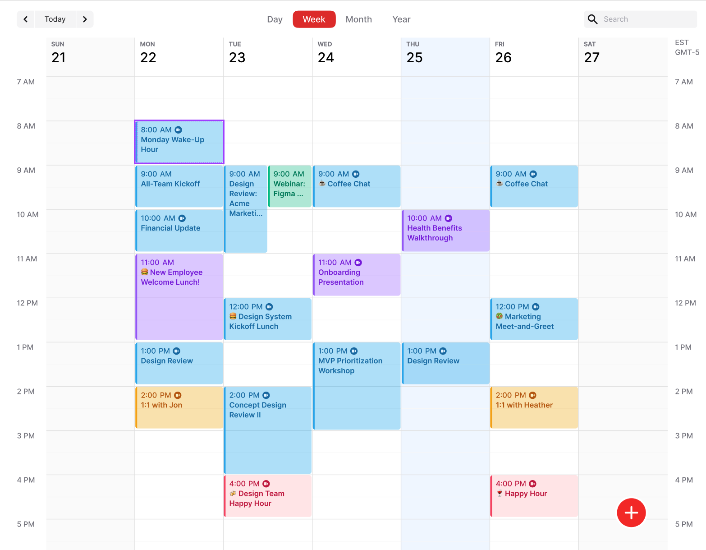

## Project description

The calendar application is designed to help users manage their time by providing an easy-to-use platform for scheduling, tracking, and organzing events. It allows users to create, modify, and view appoinments, as well as various activities into a calendar. -

## Functions in our project

- Ability login and create a user
- Create events to the calendar
  - Select a time
  - Select a name
  - Select a description (optional)
  - Select if events span over multiple days
  - Select colour for event (optional)
- Ability of edit information for created event
- Ability to create multiple calendars for each user

## User story

**Person 1:** Phil, Phil is a student who engages in various hobbies/activities in his free time.

- **Wants:** He wants to create a calendar where he can keep track of both his school schedule and different hobbies/activities. He therefore wishes to create events for when he has school and when he plans to engage in his hobbies/activities.

- **So that:** He can have an overview of upcoming events according to his calendar.

**Person 2:** Bah, Bah is an aspiring developer whose schedule frequently changes based on the project he's working on.

- **Wants:** He wants to create new events/appointments in his calendar but also have the ability to change the time or location of these events.

- **So that:** He can keep his calendar updated for all his future projects.

## Calender mockup

