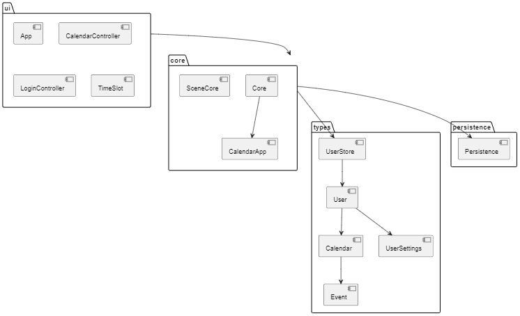

# Release 2

This is the second release of the the project. It contains the first version of a working calendar app with minimal features.

### Project architecture

The architecture we have chosen for this app is a layered architecture, aslo known as the N-tier architecture. It has 4 layers, where each layer has only one, well defined, responcibility.

- The UI module is the UI layer. Its responcibility is giving the user an interface to interact with the rest of the application. It shows the user information and interprets what the user wants to do.
- The Core module is the service layer. This is where all the business logic and all other calculations live. It is the glue that lets the UI layer and the data access layer communicate. This makes the architecture more flexible, as we wont need to change the UI if we choose to change how data is stored.
- The Types module is the data access layer. It defines how data is stored and provides an interface to interact with it. 
- The Persistence module is the persistence layer. It's responcibility is to persist the data. Right now it provides functions to serialize/deserialize the data from the types module and read it from/write it to a file.

This architecture is compliant with the Model-View-Controller architectural pattern. The types module is the model. It defines what data is stored and how. The UI module constites the view aspect and has minimal logic of its own. Lastly, the core module is the controller, acting as an interafce between the view and the model.

### Work habits

We have been trying to use gitlab issues and branches more properly since release 1. Every submodule is a separate issue and has its own branch. We tried to keep them separately as much as we could, however this was not completely possible, as the submodules interoperate pretty closely and developing them in sequence would take too much time. As a result there are cases where the branches are merged into one another to allow for paralell development of all the submodules. Despite this, we strived to keep changes related to each submodule in its own branch and pull from other branches only when the functionality added in that branch was necessary for further development of the current branch.

We feel this has generally worked very well. We were able to get things done in paralell with minimal interoperability issues. It also helped that we discussed the overarching architecture of the app beforehand, so that everyone was more or less on the same page. There were of course cases where some people had differing opinions about individual desing choices, but we were able do discuss these and come up with a better solution that fit our needs.

### Code quality

As mentioned in realease 1 we have chosen to use junit5 and jacoco for tests and test coverage reports respectively. Each submodule has a set of its own unit tests and jacoco is run in every submodule to generate a test coverage report for each submodule individually. After every submodules tests have been run and test coverage reports generated, the build-tools submodule runs. Its only purpose, per now, is to go into each individual submodule and compile every test coverage report into one global report, spanning the entire project. This way we have all the information in one spot. We can see the aggregated test coverage percentage across the entire project as well as a test coverage for each submodule seperately.

We have pretty good test coverage on every module except UI, as we had some trouble getting testFX to work. That is something we are going to work on for Group Assignment 3. Aside from that every module is well tested where it makes sense.

### AI statement

[Own md-file for ai statement](./ai-tools.md)
