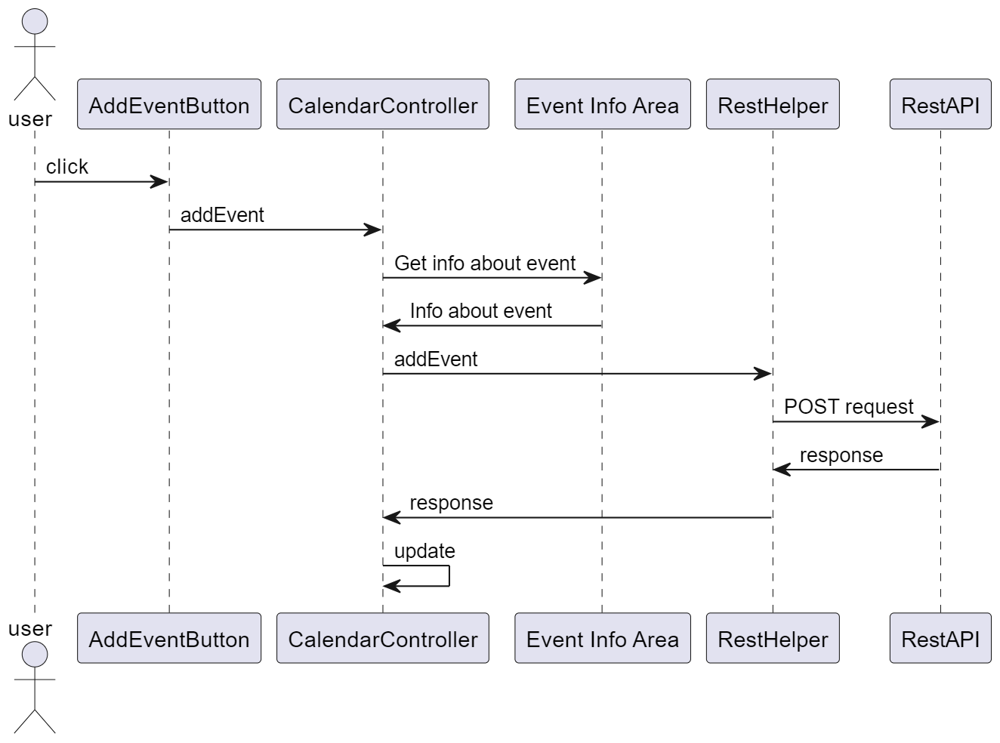
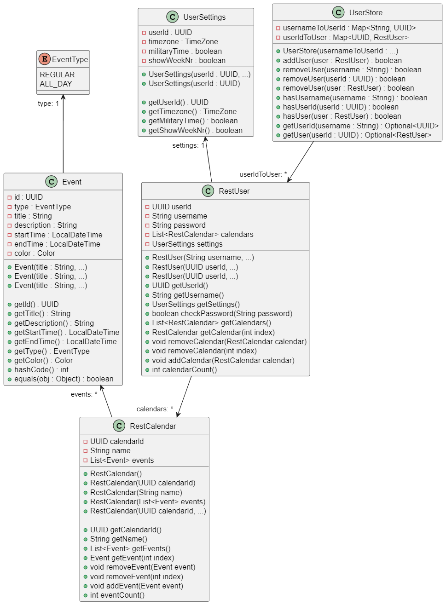
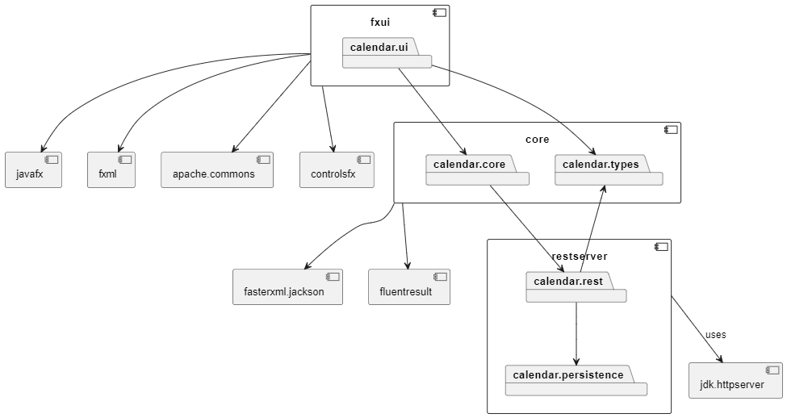

# Release 3

This is the third release for the project. It contains the a complete working calendar app, which has a backend that is running on a seperate web server.

## Project architecture

Since Release 2, we have added a REST module that serves as an interface to expose the application's functionality via RESTful endpoints. This module receives HTTP requests, parses them, invokes the necessary business logid, and returns appropriate responses.

The new Module forwards requests to the Core layer and translates the responses from the Core layer into REST API responses.

The rest of the project architecture remains the same as it was in [Release 2](../release2/README.md).

<table>
  <tr>
    <td><strong>Sequence diagram of application</strong></td>
    <td><strong>Class diagram of application</strong></td>
    <td><strong>Package diagram of application</strong></td>
  </tr>
  <tr>
    <td>
      
    </td>
    <td>
      
    </td>
    <td>
      
    </td>
  </tr>
</table>

## Final functions for application

For release 3 we decide not to change the framework instead we added alot of extra features as seen below.

**Explanation of Changes:** We updated the app's functionality to prioritze essential features and ensure timely project completion. Below are the functions we removed and added, with reasons for these decisions.

**Removed features:**

- Optional event repeat selection
- Optional location selection
- Event reminders
- Event sharing
- Customizable calendar layouts (daily, weekly, or monthly views)

Most of these features were removed due to time constraints and were deemed non-essential for the app's core functionality.

**Added features:**

- User account creation and login
- Option set event name
- Optional description field
- Option for events to span multiple days
- Multiple calendar creation for each user

These features were added because they aligned with the project description and were mostly straightforward to implement.

## Work habits

Our work habits have remained largely consistent since Release 2, with the primary change being that we now create more specific issues. In Release 2, we often created issues that were quite broad, which caused challenges when attempting to work in parallel ([explained in greater detail under Work Habits in Release 2](../release2/README.md)). By defining issues more narrowly, we were able to merge branches into the development branch earlier and collaborate more efficiently, reducing the need for complex merges and allowing us to work on separate issues with minimal conflict. We have also writen javaDoc for the whole project, making it easier for all the members to understand the code, therfor increasing effeciency and intergration.

## Code quality

We have implemented Checkstyle to maintain consistent code formatting and ensure adherence to coding standards. Additionally, we have documented the entire project with JavaDoc to improve code readability for anyone who wants to understand how the code works.

To futher enhance code quality, we refactored a big portion of the code to minimize duplication and improve overall structure, making the concise and readable.

## Test coverage

Our project has strong test coverage, addressing what we consider the most essential components that require testing. Currently, coverage exceeds 80% overall. However, we are missing some coverage for `calendarController` and `popUpController`. This is due to challenges in mocking UI changes triggered by adding or editing events.

## REST-service

## Contribution

[Own md-file for discussing the contribution](./contribution.md)

## Sustainability

[Own md-file for discussing the sustainability](./sustainability.md)

## Challenges

[Own md-file for the challenges we expirenced](./challenges.md)

## Known issues

### New Line Characters in Descriptions:

When adding a description for an event, pressing "Enter" to create a new line prevents the event from being added. This occurs because the HTTP request does not accept new line characters, as HTTP header values cannot contain line breaks or special characters.

- **Suggested Fix:**
  - Implement a function to remove or replace new line characters in the header value before sending the HTTP request

### Overlapping events

Events scheduled at the same time currently overlap, causing one event to hide another.

- **Suggested Fix:**
  - Implement a check for overlapping events.
  - Create a function to adjust the event width, allowing events to display side by side instead of overlapping.

### Readability of Dark-Colored Events:

When events are assigned dark colors, the event title can become difficult to read due to insufficient contrast.

- **Suggested Fix:**
  - Add color-check function to automatically adjust the title color based on the event's background color for optimal readability.

### Reason for Remaining Unfixed:

Due to time constraints and prioritization, these issues have not been resolved in the current release.

## AI statement

[Own md-file for ai statement](./ai-tools.md)
