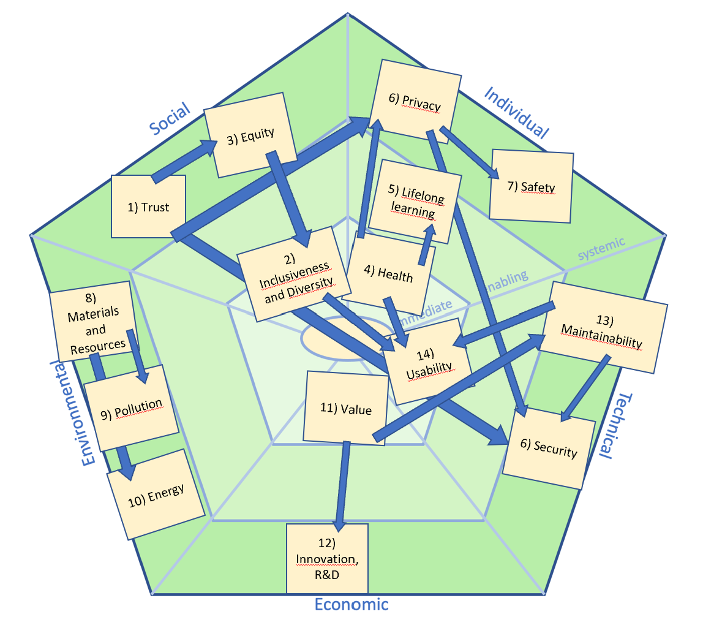

# Sustainability

### Social Sustainability

#### Trust:

The app collects user information for account creation and login, which necessitates secure data handling to maintain user trust. If users perceive the app as reliable in terms of privacy and data security, it can help build stronger trust in the service.
Level: Systemic (as data protection policies and practices influence long-term trust).

#### Inclusiveness and Diversity:

By offering a user-friendly and simple design, the app can be accessible to a wide range of users across different ages, backgrounds, and technical abilities.
Level: Immediate (through accessible design and functionality).

#### Equity:

The system treats all users equally, ensuring fair and consistent experiences across the user base.
Level: Systemic (through universal design principles)

### Individual Sustainability

#### Health:

The calendar app can positively impact mental health by helping users stay organized and reducing stress associated with planning.
Level: Immediate (in user experience) and Enabling (for better time management).

#### Lifelong Learning:

The app promotes organizational skills and time management as users navigate its features, contributing to personal development over time.
Level: Enabling (by fostering time management and organizational skills).

#### Privacy:

The app collects personal data for account management purposes. However, data transmitted from users is not encrypted, which may present privacy risks, such as potential exposure of personal events to unauthorized viewers.
Level: Systemic (data management policies have a long-term impact on privacy)

#### Safety:

Since the app is primarily digital and not directly involved in physical safety, it does not present significant safety risks. However, potential data breaches could affect users’ sense of digital safety.
Level: Systemic (data protection enhances the digital safety of users).

### Environmental Sustainability

- Depends alot where the application ends up being hosted.

#### Materials and Resources:

As a digital application, the calendar app does not require physical materials. However, it may impact server usage and energy consumption if hosted on large-scale infrastructure.
Level: Systemic (through server energy demands and the resources required for cloud infrastructure).

#### Pollution:

Minimal direct impact since it’s a virtual application, but data centers where it’s hosted can contribute to environmental impacts, including emissions from non-renewable energy sources.
Level: Systemic (through the data center’s environmental impact).

#### Energy:

Server usage, especially as the app scales, requires careful consideration of energy demands. Opting for hosting providers that use renewable energy sources can mitigate the environmental impact.
Level: Systemic (energy usage affects sustainability long-term).

### Economic Sustainability

#### Value:

The app generates value by enhancing productivity, potentially saving users time and improving personal or business efficiency.
Level: Immediate (by directly offering users an efficiency tool).

#### Innovation, R&D:

Future development and improvements to the app can lead to new features and create potential revenue streams. Investments in R&D could thus be financially beneficial.
Level: Systemic (for long-term R&D investment and innovation impact).

### Technical Sustainability

#### Maintainability:

Code should be maintainable over the long term, with regular updates to address bugs and compatibility with new operating systems or hardware. We have added javaDoc throughout the project and implemented exstensive test for each class.
Level: Systemic (sustaining maintainability over time).

#### Usability:

The app should be intuitive and accessible, enhancing productivity and user satisfaction. While no formal user testing has been conducted, the app's simplicity and limited features set make it easy to understand.
Level: Immediate (through user interaction) and Enabling (by simplifying time management).

#### Security:

Security is essential to protect user data and maintain trust. Without implemented encryption, there is a risk of unauthorized users accessing personal information.
Level: Systemic (since security impacts user trust long-term).
