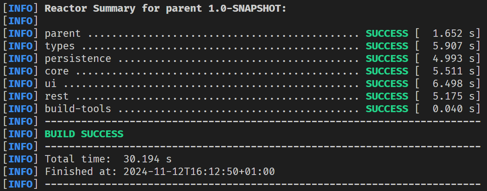

# JavaFX Calendar

[Open in Eclipse Che](https://che.stud.ntnu.no/#https://gitlab.stud.idi.ntnu.no/it1901/groups-2024/gr2404/gr2404)

## Description

This project is a simple calender. The project is containd within `./calendar`. For more information about the calendaar, see the [README.md](./calendar/readme.md) file inside the `./calendar` folder.

For more information about a spesific realease of the project, see the [Link to docs](#link-to-docs) section at the bottom of this document.

## Building and running the project

The project uses maven to build and run.

To build the project move into the root of the application with `cd ./calendar` folder, and run the command `mvn clean install -DskipTests`. If you want to run the tests the project to see if everything is working correctly, run the command `mvn test`. You should see an overview like the one here:
 If anytrhing says FAILURE or SKIPPED, something went wrong.

This project has both a frontend, and a backend using restAPI, and you therefor need two terminals to runt the application.

To deploy the backend; type the command `cd ./calender` if you aren't there already and type the command `mvn exec:java`. Wait a few seconds for the program to start up. A restAPI server should now be running.
**If not** try `mvn clean install -DskipTests` again, before running the server command once more.

Now open a new terminal window and cd back into the calendar folder using `cd ./calendar`. Now you can run `mvn javafx:run`. After a few seconds a window should appear on your screen. You can now explore the application freely.

## How to run project in Eclipse Che

To run this project in eclipse che change directory to calendar using `cd ./calendar`. Then run the run.sh script using `./run.sh`. This script will automatically install all dependencies, compile the project and run both the rest api and javafx ui. To see and interact with the app, open the "endpoint" tab in the editor and open the endpoint at port `6080` (6080-tcp-desktop-ui) in a new tab.

## How to test the project in Eclipse Che

Testing in eclipse che is done similarly to running the project. Change directory to calendar using `cd ./calendar` if you haven't already. Then run the test.sh script using `./test.sh`.

## Packaging

Unfortunately, we did not manage to configure the project with jlink or jpackage. We had a lot of issues with "automatic modules" that we could not fix, even with studass guidance. We also tried to package the project to a jar file with various maven plugins and console commands, however this did not yield better results. Despite this, we believe the overall quality of our application is good and we hope this issue won't affect out grade too much.

## Technical Information

Java version: `21.0.1`

Maven version: `3.8.0`

## Link to docs

-   [Release 1](./docs/release1/readme.md)
-   [Release 2](./docs/release2/readme.md)
-   [Release 3](./docs/release3/readme.md)
